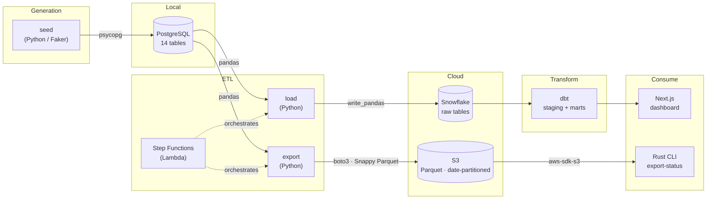

# data_lab

A homelab sandbox for the full modern data stack: synthetic fintech data flows from generation through Postgres, S3, Snowflake, and a dbt transformation layer, with a Next.js dashboard and a Rust CLI for ops.

The fictional company is **XMOB & Co.** — a FinTech operating across three business lines: Payments & Settlement (P&S), Fleet & Commercial Cards (FCC), and Risk & Underwriting (RUS). See `business_context.md` for the full domain model.

## Repository Layout

```
data_lab/
├── rust/          # Cargo workspace — core types, S3 connector, CLI binary
├── python/        # uv-managed package — connectors, seed, Lambda handlers
├── dbt/           # dbt project — staging views + analytical marts (Snowflake + DuckDB)
├── ui/            # Next.js dashboard — pipeline status, S3 exports, Step Functions
├── infra/         # AWS state machines and provisioning notes
├── data/          # SQL schemas, reference data, seed CSVs
└── .github/       # CI workflows
```

## Data Pipelines



### Pipeline 1 — Seed: Generate → PostgreSQL

`just seed` generates synthetic XMOB data with Faker and loads it into local Postgres.

**Schema** (4 reference + 10 core tables):

| Domain | Tables |
|--------|--------|
| Reference | `mcc_code`, `geography`, `industry_segment`, `model_version` |
| P&S | `merchant`, `account`, `txn`, `settlement`, `dispute` |
| FCC | `fleet_customer`, `card` |
| RUS | `underwriting_decision`, `risk_score`, `partner` |

Generation is deterministic via `--seed`. Defaults: 120 merchants, 80 fleet customers, seed=42.

```bash
just seed                 # defaults
just seed 200 150 42      # 200 merchants, 150 fleet customers, seed=42
```

### Pipeline 2 — Export: PostgreSQL → S3

`just export` reads all tables from Postgres, serializes to Snappy-compressed Parquet, and uploads to S3:

```
fintech/{table}/exported_at={YYYY-MM-DD}/{table}.parquet
```

```bash
just rust-export-status   # Rust CLI — list keys and file sizes
```

### Pipeline 3 — Load: PostgreSQL → Snowflake

`just load-snowflake` reads from Postgres and writes directly to Snowflake via `write_pandas`. Column names are uppercased to match Snowflake DDL convention. Requires Snowflake credentials in `.env`.

Both pipelines can be orchestrated via AWS Step Functions:

```bash
just aws-sfn-start        # trigger export → load in sequence
just aws-sfn-status       # last 5 execution statuses
```

### Pipeline 4 — Transform: Snowflake → dbt marts

`just dbt-run` runs the dbt project against Snowflake, producing staging views and analytical mart tables:

```
staging/   stg_txn, stg_merchant, stg_account, stg_settlement, stg_dispute,
           stg_fleet_customer, stg_card, stg_underwriting_decision,
           stg_risk_score, stg_mcc_code, stg_geography

marts/payments/   fct_transactions, fct_settlements, dim_merchant
marts/fleet/      fct_card_transactions, dim_fleet_customer
marts/risk/       fct_underwriting_decisions, dim_model_performance
```

dbt also supports a local DuckDB target for offline development (no Snowflake needed):

```bash
just dbt-seed-local       # pull Postgres → data/local.duckdb
just dbt-local            # run + test all models against DuckDB
```

---

## Prerequisites

| Tool     | Install                                              | Purpose               |
|----------|------------------------------------------------------|-----------------------|
| Rust     | `rustup`                                             | Cargo workspace       |
| uv       | `curl -LsSf https://astral.sh/uv/install.sh \| sh`  | Python env            |
| just     | `cargo install just`                                 | Task runner           |
| Docker   | your package manager                                 | Local Postgres        |
| Node 20+ | your package manager                                 | Next.js dashboard     |
| dbt      | `pip install -r dbt/requirements.txt`                | Transformations       |
| AWS CLI  | `pip install awscli` or your package manager         | S3 / Lambda / SFN     |

## Quick Start

```bash
cp .env.example .env          # fill in credentials

# Local stack
just db-up                    # start Postgres + pgAdmin
just py-install               # install Python deps
just rust-build               # compile Rust workspace
just seed                     # generate XMOB seed data
just test                     # run all tests

# dbt (local, no Snowflake needed)
just dbt-install              # install dbt + deps
just dbt-seed-local           # seed DuckDB from Postgres
just dbt-local                # run + test all dbt models

# UI dashboard
just ui-install               # npm install
just ui-dev                   # http://localhost:3000

# Cloud (requires AWS + Snowflake credentials)
just aws-bucket-create
just export
just load-snowflake
just dbt-run
```

## Environment Variables

See `.env.example` for all required variables. Never commit `.env`.
