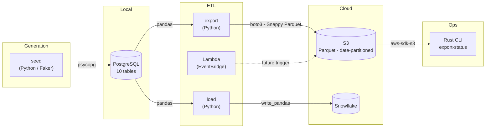

# data_lab

A homelab sandbox for experimenting with AWS (S3, Lambda, EventBridge), Snowflake,
and performance-oriented data work in Rust, with Python as the glue layer.

## Repository Layout

```
data_lab/
├── rust/          # Cargo workspace — core types, S3 connector, CLI binary
├── python/        # uv-managed package — connectors, Lambda handlers
├── infra/         # AWS provisioning notes (infra tooling TBD — see infra/README.md)
├── data/          # Reference schemas (SQL) and seed data (CSV)
└── .github/       # CI workflows
```

## Data Pipelines

Three connected pipelines move synthetic fintech data from generation through to cloud storage and a data warehouse.



### Pipeline 1 — Seed: Generate → PostgreSQL

`just seed` generates synthetic fintech data with Faker and loads it into local Postgres.

**Data model** (2 dims, 4 facts):

| Table | Description |
|---|---|
| `dim_clients` | Commercial client companies — industry, SIC code, size band, state |
| `dim_products` | Embedded risk-financing product catalog |
| `fact_coc_signals` | Change-of-control risk signals; one per CRM opportunity, drives quotes |
| `fact_quotes` | Quotes generated per signal and product |
| `fact_sold_policies` | Policies converted from accepted quotes |
| `fact_renewals` | Annual renewal events on active policies |

Generation is deterministic: `--seed` fixes the random state for reproducible datasets. Default is 200 clients.

```bash
just seed             # 200 clients, seed=42
just seed 500 99      # 500 clients, seed=99
```

### Pipeline 2 — Export: PostgreSQL → S3

`just export` reads all six tables from Postgres, serializes them to Snappy-compressed Parquet, and uploads to S3 under a date-partitioned key layout:

```
fintech/{table}/exported_at={YYYY-MM-DD}/{table}.parquet
```

Inspect what has landed:

```bash
just rust-export-status          # Rust CLI — lists keys and sizes
```

### Pipeline 3 — Load: PostgreSQL → Snowflake

`just load-snowflake` reads the same six Postgres tables and writes them directly to Snowflake via `write_pandas`. Column names are uppercased to match Snowflake DDL convention (`dim_clients` → `DIM_CLIENTS`). Requires Snowflake credentials in `.env`.

### Lambda (Scaffold)

`python/lambdas/example_trigger/` is an EventBridge-triggered Lambda that currently samples the S3 bucket. It is the scaffold for a future event-driven pipeline trigger. Deploy with `just aws-lambda-deploy`.

---

## Prerequisites

| Tool        | Install                                                    | Purpose              |
|-------------|------------------------------------------------------------|----------------------|
| Rust        | `rustup`                                                   | Cargo workspace      |
| uv          | `curl -LsSf https://astral.sh/uv/install.sh \| sh`        | Python env           |
| just        | `cargo install just`                                       | Task runner          |
| AWS CLI     | `pip install awscli` or your package manager               | Local AWS auth       |

## Quick Start

```bash
cp .env.example .env          # fill in your credentials
just py-install               # install Python deps
just rust-build               # compile Rust workspace
just test                     # run all tests
just aws-bucket-create        # provision sandbox S3 bucket (see infra/README.md)
```

## Environment Variables

See `.env.example` for all required variables. Never commit `.env`.
